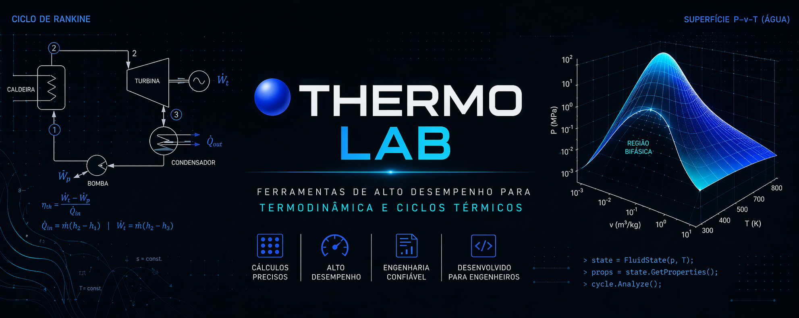

  

   

  # 🔵 Arvexa Thermo Lab (v0.2.1-alpha)
  
  
  
  

  > **AAD-Systems** | High-Performance Tools for Chemical Engineering
  
  *O Thermo Lab é um motor de processamento termodinâmico desenhado para eliminar erros em cascata em projetos de ciclos térmicos, automatizando a interpolação e o rastreamento de estados físicos com foco em precisão científica.*

  **[🚀 Acessar Aplicação Web](https://aad-systems.github.io/thermolab/)**

---

## 📖 Sobre o Projeto

O **Arvexa ThermoLab** nasceu da necessidade prática de mitigar a volatilidade de rascunhos manuais e erros de interpolação em ciclos termodinâmicos complexos (Rankine, Brayton, Refrigerantes). O foco central é a **integridade dos dados**: garantir que as propriedades de cada estado (P, T, h, s, u) sejam rastreáveis, persistentes e matematicamente coerentes.

### 🔬 Orientação e Colaboração Acadêmica
Este projeto está em constante evolução técnica. **Busco ativamente orientação acadêmica e feedback de especialistas** nas áreas de Termodinâmica de Processos e Simulação Numérica para refinar os algoritmos de interpolação e expandir a base de dados de substâncias puras. 

---

## 🚀 Funcionalidades Principais (MVP)

* **Motor de Interpolação Bilinear:** Sistema de 3 estágios projetado para tratar singularidades matemáticas (X1 = X2), evitando erros de `NaN` ou `Infinity`.
* **State Tracker & Persistence:** Sistema de gestão de estados via *localStorage*. Os dados do ciclo são indexados e persistentes no navegador, eliminando a dependência de anotações físicas.
* **Fast-Input Grid:** Interface otimizada para entrada rápida de limites de tabelas técnicas (ex: Moran/Shapiro).
* **Industrial Export:** Geração de relatórios de sessão em `.txt` para auditoria de cálculos e registros acadêmicos.

## 🛠️ Stack Técnica

* **Core Engine:** C# 12 / .NET 8 (Lógica portada para ambiente Web).
* **Frontend:** Vanilla JavaScript (ES6+) com foco em latência zero.
* **Styling:** Tailwind CSS (Interface otimizada para ambientes de laboratório).
* **Typography:** JetBrains Mono & Syne (Foco em legibilidade de dados numéricos).

## 🗺️ Roadmap de Desenvolvimento

- [x] **v0.1.0:** Motor matemático base e rastreamento de estados.
- [x] **v0.2.0:** Persistência de dados e motor de exportação de relatórios.
- [ ] **Fase 3:** Implementação de Módulo de Visão Computacional (OCR) para leitura automatizada de tabelas físicas.
- [ ] **Fase 4:** Integração com bibliotecas externas de propriedades termodinâmicas (API CoolProp).

---

## 🤝 Contato e Feedback

Se você é professor, pesquisador ou estudante e deseja colaborar ou fornecer feedback técnico, sinta-se à vontade para abrir uma **Issue** ou entrar em contato:

* **GitHub:** [github.com/AAD-Systems](https://github.com/AAD-Systems)
* **Instagram:** [@taua.of](https://www.instagram.com/taua.of)

  Desenvolvido por <b>Tauã Miguel</b> para a AAD-Systems.

